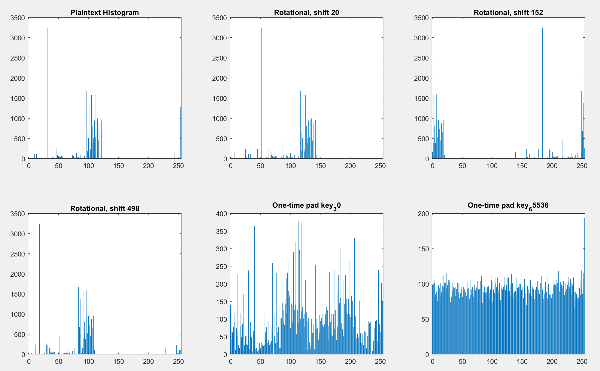
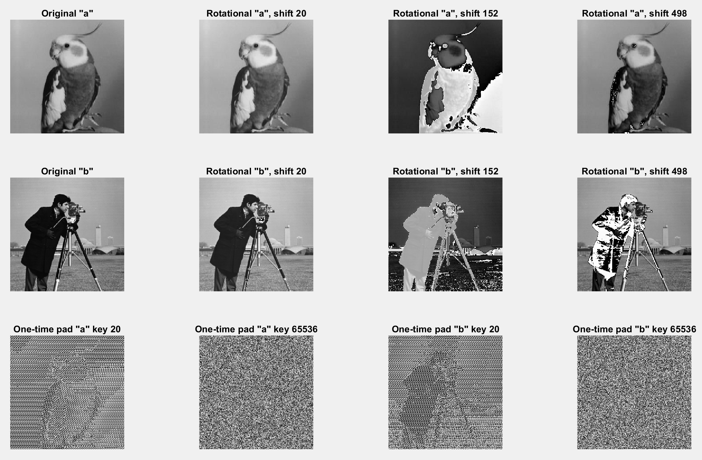
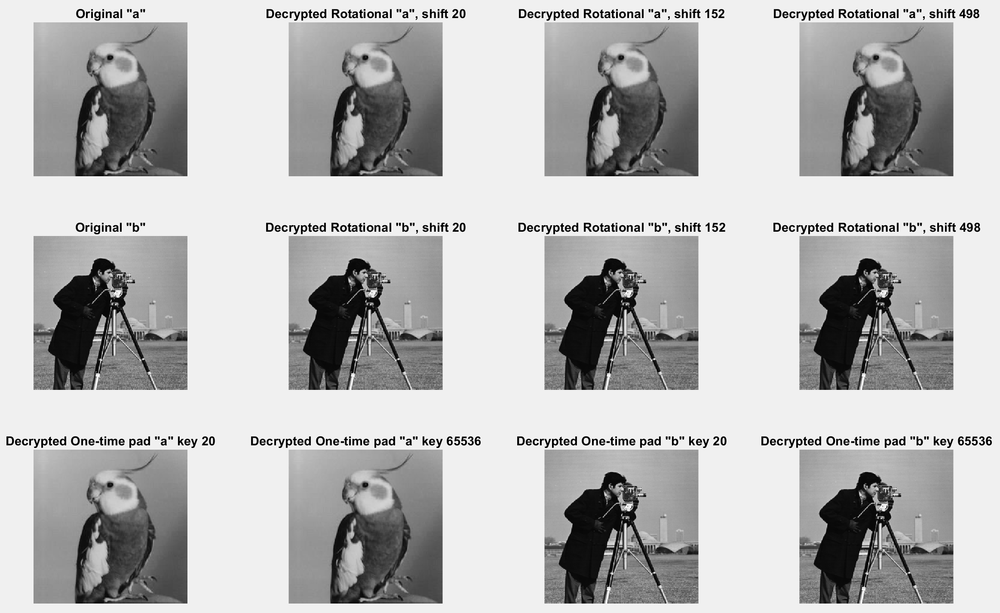

# Encryption and Decryption Functions

This repository contains MATLAB functions implementing rotational and one-time pad ciphers for both text and image encryption and decryption.

## Functions

### `rotational_cipher(text, key, mode)`

-   Encrypts or decrypts text using a rotational cipher.
-   **Inputs:**
    -   `text`: The input text (string).
    -   `key`: The shift value (integer).
    -   `mode`: `'e'` for encryption, `'d'` for decryption.
-   **Output:**
    -   `encrypted`: The encrypted or decrypted text (uint8 array).

### `one_time_pad_cipher(text, key, mode)`

-   Encrypts or decrypts text using a one-time pad cipher.
-   **Inputs:**
    -   `text`: The input text (string).
    -   `key`: The one-time pad key (uint8 array).
    -   `mode`: `'e'` for encryption, `'d'` for decryption.
-   **Output:**
    -   `encrypted`: The encrypted or decrypted text (uint8 array).

### `rotational_cipher_image(image, shift, mode)`

-   Encrypts or decrypts an image using a rotational cipher.
-   **Inputs:**
    -   `image`: The input image.
    -   `shift`: The shift value (integer).
    -   `mode`: `'e'` for encryption, `'d'` for decryption.
-   **Output:**
    -   `encrypted_image`: The encrypted or decrypted image.

### `one_time_pad_cipher_image_key(image, key, mode)`

-   Encrypts or decrypts an image using a one-time pad cipher.
-   **Inputs:**
    -   `image`: The input image.
    -   `key`: The one-time pad key (uint8 array).
    -   `mode`: `'e'` for encryption, `'d'` for decryption.
-   **Output:**
    -   `encrypted_image`: The encrypted or decrypted image.

### `test()`

-   Demonstrates the functionality of the rotational and one-time pad ciphers on sample text data.
-   Displays the original, encrypted, and decrypted text, along with their ASCII representations.

### `encrypt_txt_file()`

-   Encrypts the text from "PolishHistory.txt" using rotational and one-time pad ciphers.
-   Generates histograms of the plaintext and encrypted data.

### Histogram for Encrypted Text

### `encrypt_images()`

-   Encrypts "a.png" and "b.png" using rotational and one-time pad ciphers.
-   Displays the original, encrypted, and decrypted images.

### Encrypted Images

### Decrypted Images

### `decrypt_data(decrypted_image_filename, encrypted_text_filename, passwords_filename)`

-   Decrypts an encrypted image and text file using a list of potential keys stored in a .mat file.
-   Attempts to find the correct key by checking the readability of the decrypted text and the standard deviation of the decrypted image.

## Usage

1.  Place the MATLAB functions in your working directory.
2.  Run the desired functions from the MATLAB command window.
3.  Ensure that "PolishHistory.txt", "a.png", "b.png" and the files used in decrypt_data function are in the correct directory.
4.  To use the `decrypt_data` function, ensure that the `hasla.mat` file containing the keys is available.
5.  Uncomment last line in the main script to run `decrypt_data` function.

